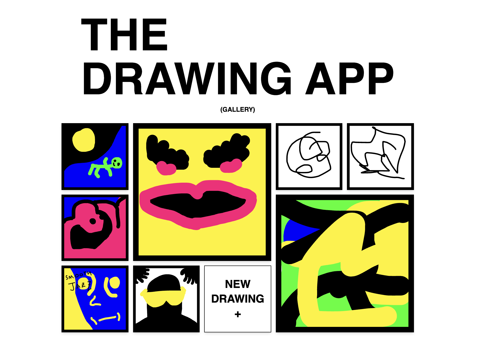

## The Initial Goal

The initial goal of this project was to satisfy user stories as requested in a code challenge. However, pretty soon into the process, my interest shifted heavily into tweaking the requirements and making something a little different.

I'm hopeful I can extrapolate on what was started here, as its becoming a project I'm pretty interested in seeing through -- that is a social platform to share and curate simple doodles with intentionally slimmed down artist tools in an unassuming package.

## Live Demo

A live demo of the project can be found [here](https://the-drawing-app.vercel.app/). On your first visit you'll be prompted to draw your first image. After you save, you'll be taken to your gallery at `/gallery`. If you click a drawing you can download or delete it. Keep drawing and see your gallery grow!

## User Stories

As mentioned, the initial concept for the app came from a coding challenge via the [devjam](https://devjam.vercel.app/project/Drawing-App-8) group. I was able to satisfy the the following user stories:

### Dev Jam User Stories

📔 User Stories

1. ✅ User can draw in a canvas using the mouse
2. ✅ User can change the color
3. ✅ User can change the size of the tool
4. ✅ User can press a button to clear the canvas

⭐ Dev JamBonus features (optional)

1. ✅ User can save the artwork as an image (.png, .jpg, etc format)
2. User can draw different shapes (rectangle, circle, star, etc)
3. User can share the artwork on social media
4. Users can start a game, and compete in a game of Pictionary (guess the drawing, https://skribbl.io/)

Implementing the drawing canvas was pretty easy, as I had built out a SVG canvas lib for myself earlier in the year while working on my personal website. I was able to copy most of that code over pretty cleanly, but I would love to have shared that library in a DRYer way -- either via monorepo or learning how to publish my own NPM package.

I suppose i did stretch the rules of the challenge by using SVG instead of HTML5 canvas, but I find SVG to me more responsive, intuitive and scalable than HTML5 canvas. SVG is just a better tool for the job imo.

### Additional User Stories

It was pretty early on in the process that I knew I wanted to pivot/adjust the challenge a bit, and focus on creating a gallery space to view and share doodles. I created a list of new user stories based off that new idea. I was able to implement a few of the new user stories in the alloted time, and I'm hopeful to continue moving forward.

🧠 New User Stories

1. ✅ User can view a gallery of doodles
2. ✅ User can delete a doodle
3. User can view/follow other users' doodles
4. User can comment on other doodles....with other doodles.
5. User's can create spaces to share doodles with other users.

## Tech Stack

I find most my work these days is in Next.js and tailwindcss. I brought in `@radix-ui` to implement the slider component. Previously I've used `@reach/slider` for similar functionality, but I really vibed with the radix docs/style, so I thought I'd try to use that instead.

### Dependencies

- Next.js (framework)
- tailwindcss (styling)
- @radix-ui (for the brush size slider)

### The SVG Canvas

The SVG canvas is a simple SVG element that I built out to be a canvas for drawing. I used the svg canvas code I built while working on my personal site. That said, a majority of that code was heavily inspired by [this](https://github.com/vinothpandian/react-sketch-canvas) library. It's a great library for drawing in SVG in react, and I found that reverse engineering it served as an **excellent** means of learning. I'm hoping do a write up on that process in the future.

Essentially, whenever a user moves there cursor over the canvas, it will create a new path element. When the user releases the cursor, the path element will be closed. I persist the paths in local state, and render them in the canvas. I also persist the current color and size in the state.

The user is given knobs to adjust the color and the size of the brush. These tools were intentionally left minimal, as the goal is to give the user a path of the least paralysis by analysis and also to level the playing field in terms of artist skill level.

When a user saves their artwork from the canvas, it will be saved to the session in their `gallery`. From the gallery the user can view their drawings, and `delete` or `download` them if they choose.

#### Downloading the drawing

Downloading the svg drawing as an image was a fun challenge, and fortuently stack overflow had some [great insight](https://stackoverflow.com/questions/37820449/image-cropped-while-converting-svg-to-png) as to how to do it. Essentially the flow works as such:

1. Serialize the SVG to a string.
2. Create a new `<canvas>` element.
3. Set the `width` and `height` of the canvas to the same dimensions as the SVG.
4. Base 64 encode the serialized SVG into a new image
5. Draw the image onto the canvas and then convert the canvas to a PNG data url.
6. Download the PNG by creating a fake link, setting the PNG data url as the href, and triggering a click of the link.
